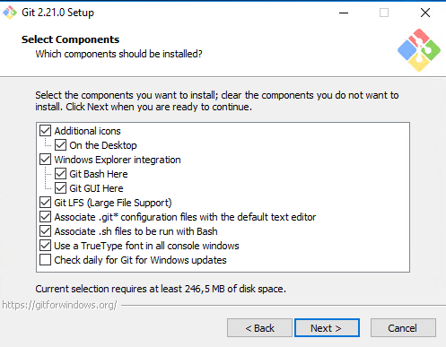
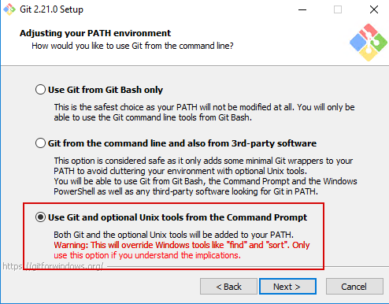
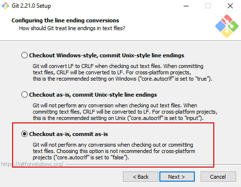

# Git

Оффициальная страничка https://git-scm.com/

Странца для скачивания https://git-scm.com/download/ 
>Прямые ссылки на скачивание: [Windows](https://git-scm.com/download/win) - [Linux](https://git-scm.com/download/linux) - [Mac](https://git-scm.com/download/mac)

## Установка

#### Рекомендуется поставить галки как скриншотах:
Оставляем все как есть:

Рукомендую выбрать сразу VSCode. Если он не установлен - можно установить перейдя по ссылке. После его установки вернитесь на страницу `Назад`, иначе кнопка `Далее` не активируется.

Пропущенные скрины остаются по умолчанию.

Готовая инструкция по установке https://infostart.ru/public/903269/#%D0%A3%D1%81%D1%82%D0%B0%D0%BD%D0%BE%D0%B2%D0%BA%D0%B0Git

## Документация

На сайте присуствует подробнейшая документация https://git-scm.com/doc

Книга ProGIT https://git-scm.com/book/ru/v2 (на разных языках, в том числе и на `русском`), обучающая и отвечающая на все вопросы как новичков, так и опытных пользователей)

## Графические клиенты

Клиенты, имеющие графический интерфейс https://git-scm.com/downloads/guis/
> Клиенты представлены не все. Например, [VSCode](../VSCode/VSCode.md) (и не только) успешно работает с GIT c помощью различных плагинов.

Замечу, что в самом Git уже есть встроенный графический клиент `gitk`. Для редких случаев можно использовать его в помощь `VSCode`.
Поэтому ставить что-то дополнительно нет никакой необходимости.

## SSH

Git имеет встроенный ssh-клиент.
Используется, например, для доступа по ssh-протоколу или для авторизации по ssh-ключам на github. В данном случае нам не требуется никакого дополнительного ПО. 

---

Навигация
* [наверх](#)
* [как работать с Git в VSCode](../VSCode/GitInVSCode.md)
* [как установить ssh-ключ в GitHub](../GitHub/GitHub.md)
