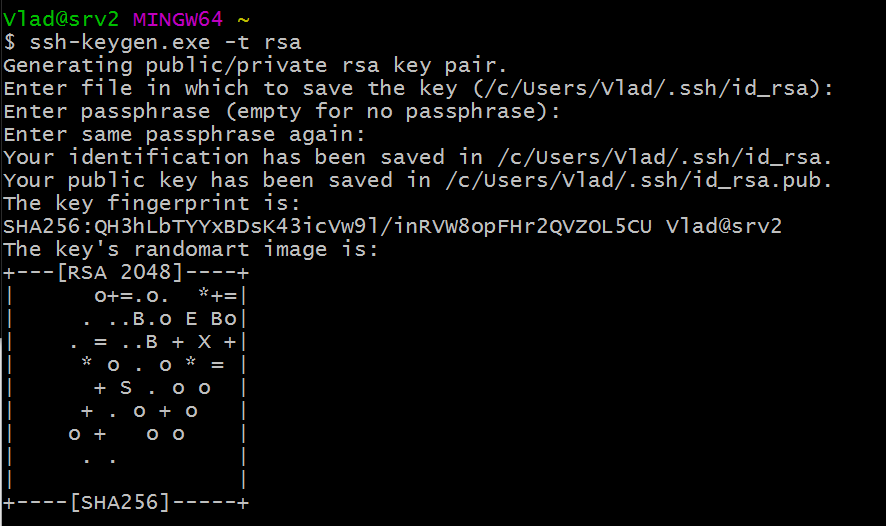

# GitHub

https://github.com

## Настройка

### Установка SSH ключа 

> Для "беспарольного" доступа (чтобы не вводить логины/пароли) регистрируется SSH-ключ. [Установленный Git](git/git.md) уже [содержит готовый ssh-клиент](git/git.md#ssh) и ничего дополнительного устанавливать не требуется

#### Генерация ключа

- запустить git-bash
- выполнить команду `ssh-keygen -t rsa`. На вопросы по вводу фраз и паролей просто нажимаем `Enter`.
> В итоге получим примерно такой вывод:
 
- скопировать содержимое файла `~/.ssh/id_rsa.pub` в буфер

#### Установка ключа в GitHub
- зайти на страницу https://github.com/settings/keys своего аккаунта github
- нажать `New SSH key` и добавить содержимое файла

## Полезное

Расширение `Octotree` для Chrome ([cсылка для скачивания](https://chrome.google.com/webstore/detail/octotree/bkhaagjahfmjljalopjnoealnfndnagc))

> Показывает открытый в окне браузера репозиторий в виде дерева в левой части окна
