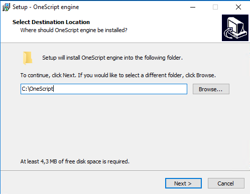

## OneScript

- он же `Oscript`
- он же `1Script`

> Скриптовый язык с синтаксисом `как у 1С` 

---

## Ресурсы

Официальная страница http://oscript.io/

Страница для скачивания http://oscript.io/downloads

Страничка http://hub.oscript.io/ - перечень библиотек, которые можно скачать через встроенный менеджер пакетов OPM. Любые другие библиотеки можно устанавливать из файлов, из открытых репозиториев. Нub - это удобный аналог repository linux, консольный аналог маркетов

Основная ссылка на github проекта onescript https://github.com/oscript-library

## Установка

1. При установке иногда удобно сменить папку на корневую (в `Program Files (x86)` может требоваться доступ от `Администратора`), но это не обязательно

2. После установки обязательно завершите свой сеанс и войдите заново. Полная перезагрузка не обязательна.
Папка установки прописывается в переменную окружения PATH. Для того, чтобы изменения применились, требуется заново авторизироваться. 