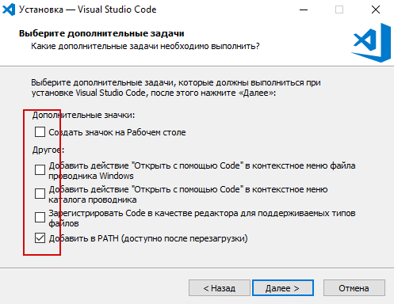
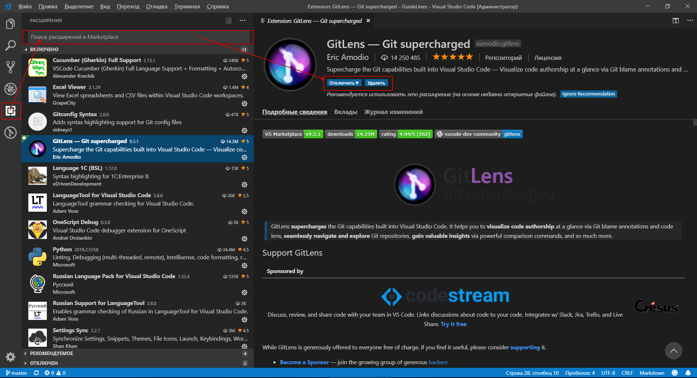

# Visual Studio Code

Цитата отсюда https://infostart.ru/public/974944/#Visual_Studio_Code:

>*`Будьте осторожны! Не привыкайте к VSC.  Освоив его возможности (поиск по регулярным выражениям, быстрая навигация мышью, плагины, интеграция с git, фон от которого не устают глаза),  конфигуратор может показаться деревянным и вызывать боль при использовании ))`*

---

Это действительно очень интересный и удобный редактор кода, легкий, бесплатный, кросплатформенный

Редактор расширяется множеством плагинов, которые устанавливаются из встроенного маркета и подючаются "на лету".

---

## Download

Скачать редактор с оффициальной страницы https://code.visualstudio.com/

В статье из шапки подробно приводится процесс установки VSC и плагинов. Рекомендую все галочки ставить 

--- 

## Plugins

Плагины можно устанавливать как из самого приложения, так и по ссылкам ниже

Джентельменский набор плагинов

- руссификация VSCode
    - [LanguageTool for Russian Language Pack for Visual Studio Code](https://marketplace.visualstudio.com/items?itemName=MS-CEINTL.vscode-language-pack-ru)
- работа с Git
    - [GitLens](https://marketplace.visualstudio.com/items?itemName=eamodio.gitlens)
- работ с OneScript
    - [Language 1C (BSL)](https://marketplace.visualstudio.com/items?itemName=xDrivenDevelopment.language-1c-bsl)
    - [OneScript Debug](https://marketplace.visualstudio.com/items?itemName=EvilBeaver.oscript-debug)
